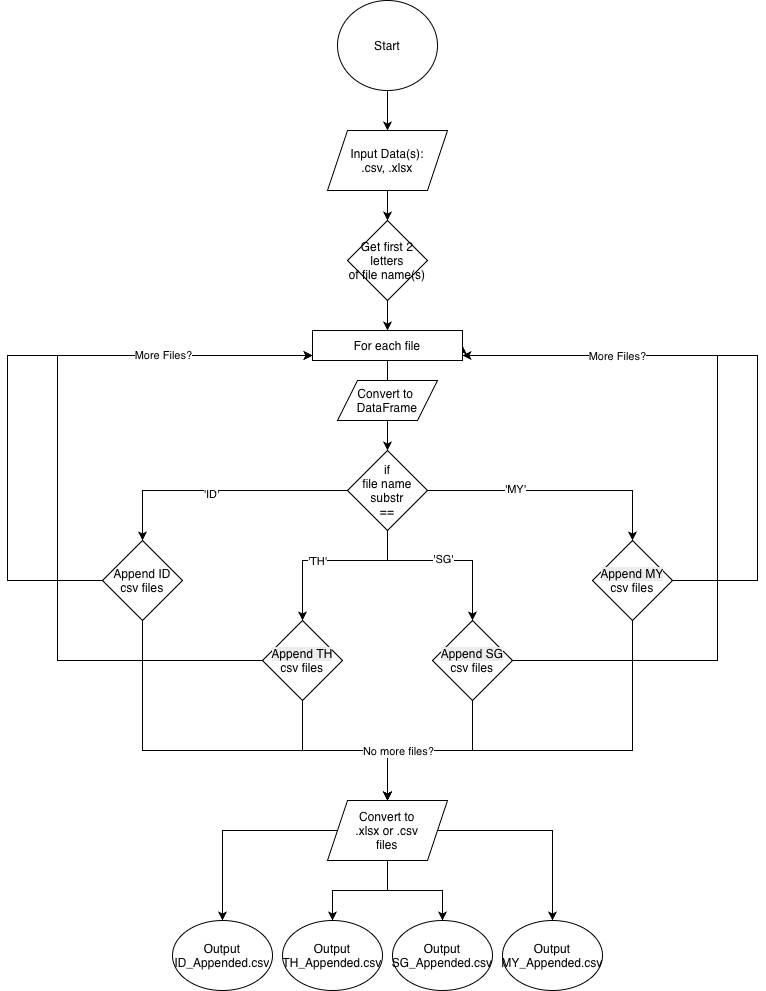

# Nethan Neo Merger - Complete Documentation

## 1. Purpose

**Nethan Neo Merger** is a Python-based module designed for merging and processing CSV files, with a focus on organizing and combining datasets by geographic region (country code).

### Primary Objectives:
- **Provide reliable utilities** to combine multiple CSV datasets (originally UTF-16 encoded with tab-separated values)
- **Organize by country code** — Automatically groups CSV files by their 2-letter country code prefix
- **Preserve data integrity** — Merges files while maintaining all columns and data without sorting
- **Enable interactive testing** — Includes a Streamlit-based web UI for manual testing and quick previews
- **Promote code reusability** — Separate business logic from UI to allow integration with other applications (CLI, API, ETL pipelines, etc.)

### Key Features:
- Read CSV files with UTF-16 encoding and tab-separated format
- Extract country codes from filenames (first 2 characters)
- Group and merge multiple CSV files by country
- Export merged results as downloadable ZIP archive
- Lightweight Streamlit demo for interactive use

### Use Cases:
- Consolidating regional datasets from multiple sources
- Preparing data for analysis across different geographic regions
- Automating file merging workflows in larger data pipelines

---

## 2. Project Structure

```
sevengen-internshipweek1.3/
├── README.md                          # Project overview and setup instructions
├── DOCUMENTATION.md                   # This file - comprehensive documentation
└── merge/                             # Main module directory
    ├── requirements.txt               # Python dependency specifications
    └── src/                           # Source code directory
        ├── __init__.py                # Package initialization
        ├── main.py                    # Streamlit app entry point
        ├── merge_csv.py               # Core merge functionality (main business logic)
        └── ui/                        # User interface components
            ├── __init__.py            # UI package initialization
            └── merge_page.py          # Streamlit UI implementation
```

### File Descriptions:

| File | Purpose |
|------|---------|
| **merge_csv.py** | Core module containing `merge_csv_files()` function; handles file reading, grouping by country code, and merging |
| **main.py** | Entry point for the Streamlit demo application |
| **merge_page.py** | Streamlit UI components including file uploader, merge button, and download functionality |
| **requirements.txt** | Python dependencies (pandas, openpyxl, streamlit, etc.) |

### Architecture:
- **Separation of Concerns**: Business logic (`merge_csv.py`) is independent from UI (`merge_page.py`) to enable integration with other applications
- **Modular Design**: Core functionality can be imported directly without Streamlit dependencies
- **Temporary Storage**: Uses system temp directory for intermediate file processing

---

## 3. I-P-O Model (Input-Process-Output)

### INPUT 📥
**What goes into the system:**

1. **Multiple CSV Files** (via Streamlit file uploader)
   - Format: CSV files with UTF-16 encoding
   - Delimiter: Tab-separated values (`\t`)
   - Naming Convention: Files must start with a 2-letter country code (e.g., `PH_data.csv`, `US_sales.csv`)
   - Content: Tabular data with headers

2. **File Metadata**
   - Filename (used to extract country code)
   - File encoding information (UTF-16)

### PROCESS 🔄
**How the system transforms the data:**

```
1. File Upload Reception
   └─► Accept multiple CSV files from user

2. File Validation
   └─► Check if files have .csv extension
   └─► Continue only for valid CSV files

3. Extract Country Code
   └─► Read first 2 characters of filename
   └─► Convert to uppercase (standardization)

4. Read & Parse CSV
   └─► Read file with UTF-16 encoding
   └─► Use tab (\t) as separator
   └─► Load into pandas DataFrame

5. Group by Country
   └─► Organize DataFrames in dictionary by country code
   └─► Example: {PH: [df1, df2], US: [df3]}

6. Merge Datasets
   └─► Concatenate all DataFrames for each country
   └─► Preserve all columns (ignore_index=True)
   └─► Don't sort columns (sort=False)

7. Export to CSV
   └─► Save merged data to temp directory
   └─► Filename format: {COUNTRY_CODE}_merged.csv
   └─► Encoding: UTF-8

8. Compress Results
   └─► Bundle all merged CSV files into ZIP archive
   └─► Filename: merged_csv_files.zip

9. Prepare Download
   └─► Buffer ZIP file in memory
   └─► Make available for user download
```

**Core Logic Flow Diagram:**
```
User Uploads Files
        ↓
Extract Country Codes
        ↓
Group by Country
        ↓
Merge (pd.concat)
        ↓
Save as CSV
        ↓
Create ZIP Archive
        ↓
Download Ready
```

### Workflow Diagram
